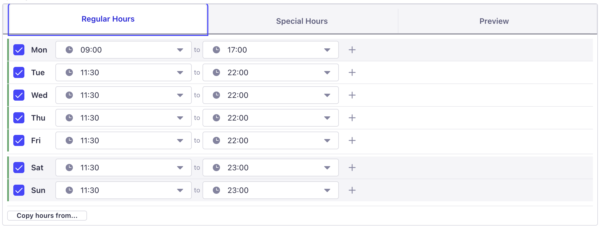
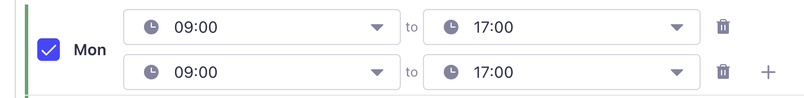
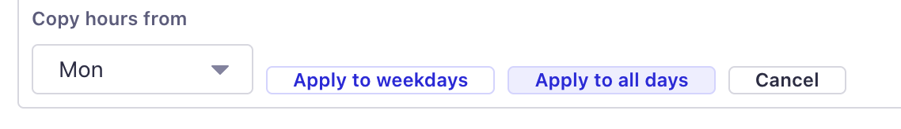
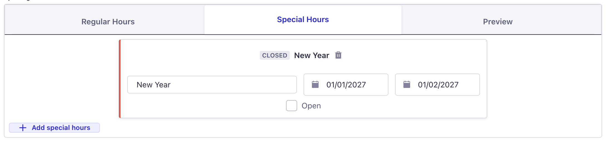
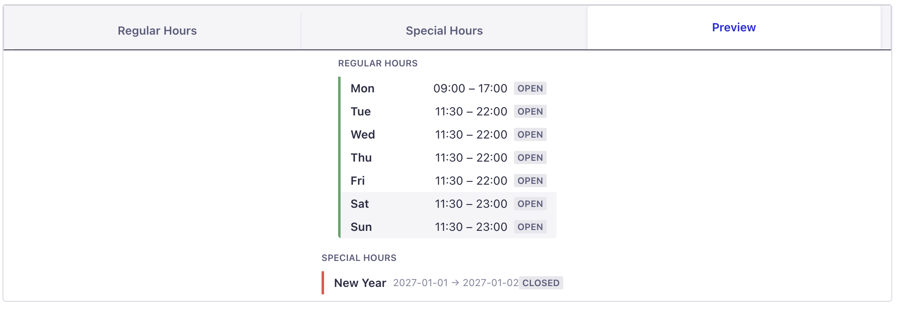

<p align="center">
  
</p>

<h1 align="center">Strapi Plugin: Opening Hours</h1>

<p align="center">
  A custom field plugin for <a href="https://strapi.io">Strapi v5</a> that provides a rich UI for managing business opening hours, split shifts, and special/holiday schedules.
</p>

<p align="center">
  <a href="https://www.npmjs.com/package/@opkod-france/strapi-plugin-opening-hours"></a>
  <a href="https://www.npmjs.com/package/@opkod-france/strapi-plugin-opening-hours"></a>
  <a href="https://github.com/opkod-france/strapi-plugin-opening-hours/blob/main/LICENSE"></a>
  <a href="https://github.com/opkod-france/strapi-plugin-opening-hours/actions/workflows/release.yml"></a>
  <a href="https://github.com/opkod-france/strapi-plugin-opening-hours"></a>
</p>

<p align="center">
  <a href="https://img.shields.io/badge/strapi-v5-2F2E8B?style=flat-square&logo=strapi&logoColor=white"></a>
  <a href="https://img.shields.io/badge/node-%3E%3D18-339933?style=flat-square&logo=node.js&logoColor=white">= 18" /></a>
  <a href="https://img.shields.io/badge/schema.org-compatible-0C479D?style=flat-square&logo=schema.org&logoColor=white"></a>
  <a href="https://img.shields.io/badge/TypeScript-strict-3178C6?style=flat-square&logo=typescript&logoColor=white"></a>
</p>

---

## Overview

This plugin adds an **Opening Hours** custom field to Strapi's Content-Type Builder. The field stores structured JSON following [Schema.org OpeningHoursSpecification](https://schema.org/OpeningHoursSpecification) conventions, making it ready for SEO and structured data integration.

## Features

- **Weekly schedule** — per-day open/closed toggle with time pickers
- **Split shifts** — multiple time slots per day (e.g. lunch + dinner)
- **Copy hours** — replicate one day's schedule to weekdays or all days
- **Special/holiday hours** — named overrides with date ranges
- **Preview tab** — read-only formatted summary of the full schedule
- **Schema.org compatible** — JSON output follows `OpeningHoursSpecification`
- **Strapi Design System** — built entirely with native Strapi components

## Screenshots

### Regular Hours

Set opening and closing times for each day of the week, with per-day open/closed toggles.

<p align="center">
  
</p>

### Split Shifts

Add multiple time slots per day to handle lunch breaks, split shifts, or varying schedules.

<p align="center">
  
</p>

### Copy Hours

Quickly replicate one day's schedule to all weekdays or all days at once.

<p align="center">
  
</p>

### Special Hours

Define named overrides for holidays or special events, with date ranges and open/closed status.

<p align="center">
  
</p>

### Preview

A read-only summary of the full schedule, including both regular and special hours.

<p align="center">
  
</p>

## Quick Start

### 1. Install

```bash
yarn add @opkod-france/strapi-plugin-opening-hours
```

### 2. Enable the plugin

```typescript
// config/plugins.ts
export default () => ({
  'opening-hours': {
    enabled: true,
  },
});
```

### 3. Rebuild and start

```bash
yarn build
yarn develop
```

### 4. Add the field

1. Open the **Content-Type Builder**
2. Add a new custom field and select **Opening Hours**
3. Save the content type
4. The field appears in the content editor with three tabs: **Regular Hours**, **Special Hours**, and **Preview**

## JSON Structure

The field stores a single JSON object with two arrays:

```json
{
  "regularHours": [
    {
      "dayOfWeek": "Monday",
      "isOpen": true,
      "timeSlots": [
        { "opens": "09:00", "closes": "12:00" },
        { "opens": "14:00", "closes": "18:00" }
      ]
    },
    {
      "dayOfWeek": "Sunday",
      "isOpen": false,
      "timeSlots": []
    }
  ],
  "specialHours": [
    {
      "label": "Christmas Day",
      "validFrom": "2025-12-25",
      "validThrough": "2025-12-25",
      "isOpen": false,
      "timeSlots": []
    }
  ]
}
```

### Field Reference

| Field | Type | Description |
|-------|------|-------------|
| `dayOfWeek` | `string` | Schema.org day name (`Monday`–`Sunday`) |
| `isOpen` | `boolean` | Whether the business is open |
| `timeSlots` | `array` | Time ranges; empty when closed |
| `opens` / `closes` | `string` | Time in `HH:MM` 24-hour format |
| `label` | `string` | Name for a special hours entry |
| `validFrom` / `validThrough` | `string` | ISO date (`YYYY-MM-DD`) |

## Development

```bash
# Install dependencies
yarn install

# Build the plugin
yarn build

# Watch mode (rebuilds on changes)
yarn watch

# Run tests
yarn test

# Run tests in watch mode
yarn test:watch
```

### Local Development

Link the plugin for local testing:

```bash
# In the plugin directory
yarn link

# In your Strapi project
yarn link @opkod-france/strapi-plugin-opening-hours
```

Then add an explicit resolve path in `config/plugins.ts`:

```typescript
export default () => ({
  'opening-hours': {
    enabled: true,
    resolve: './node_modules/@opkod-france/strapi-plugin-opening-hours',
  },
});
```

## Requirements

| Dependency | Version |
|------------|---------|
| Strapi | `>= 5.0.0` |
| Node.js | `>= 18` |
| React | `17.x` or `18.x` |

## Contributing

Contributions are welcome! Please open an issue or submit a pull request.

This project uses [conventional commits](https://www.conventionalcommits.org/) and [semantic-release](https://github.com/semantic-release/semantic-release) for automated versioning.

## License

[MIT](LICENSE) &copy; [Opkod France](https://github.com/opkod-france)
